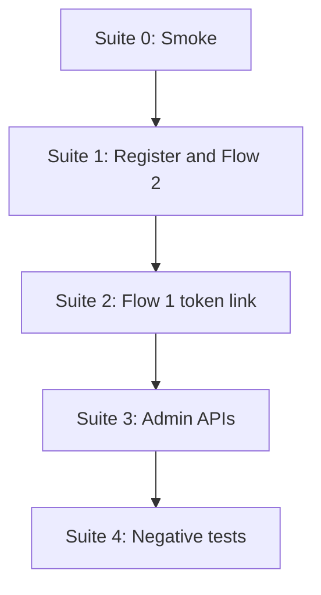

# APAD — API Testing Guide

Step-by-step order for testing all APIs. Follow the suites **in sequence** the first time; later you can run negative tests independently.

**Base URL (local):** `http://localhost:8000`  
**Interactive docs:** http://localhost:8000/docs  
**Health:** `GET /health`

---

## Before you start

1. Backend running: `uvicorn app.main:app --reload --port 8000`
2. `GET /health` returns `"database": "connected"`
3. Seed enabled (`SEED_DEMO_DATA=true`) gives:
   - Demo user mobile: `9876543210`
   - Admin mobile: `9999999999`, password: `admin123`
   - Sample **Travel Campaign** (active)

**Save these between steps (Postman environment or notes):**

| Variable | Example | Used for |
| -------- | ------- | -------- |
| `mobile` | `9876543210` | Login / OTP |
| `token` | `tk_xxxx` | Flow 1 link |
| `otp` | `482910` | From send-otp response (POC mode) |
| `access_token` | JWT string | Admin + portal APIs |
| `campaign_id` | `1` | Token generation |

---

## Testing order overview



| Suite | Purpose | Auth required |
| ----- | ------- | ------------- |
| **0** | Server + DB up | No |
| **1** | Flow 2: mobile login → ad → OTP → JWT | No (until verify) |
| **2** | Flow 1: token link → ad → OTP → JWT | No |
| **3** | Admin campaigns, users, analytics | Bearer JWT (admin) |
| **4** | Wrong order / invalid data | Mixed |

---

## Suite 0 — Smoke (test first)

| # | Method | Path | Expected |
| - | ------ | ---- | -------- |
| 0.1 | GET | `/health` | `200`, `"database": "connected"` |

```bash
curl http://localhost:8000/health
```

---

## Suite 1 — Flow 2 (mobile login path)

**Story:** User registers (optional) → login check → watch ad → complete ad → send OTP → verify OTP → use JWT on portal.

Test APIs **in this exact order**.

### Step 1.1 — Register (optional if using seeded user)

| | |
| - | - |
| **Method** | `POST` |
| **Path** | `/api/register` |
| **Auth** | None |

**Body:**

```json
{
  "name": "Test User",
  "mobile": "9123456789",
  "age": 28,
  "gender": "male",
  "area": "Hyderabad"
}
```

**Expected:** `200`, user object with `role: "user"`.  
**If mobile exists:** `400` — use another number or skip to 1.2 with `9876543210`.

```bash
curl -X POST http://localhost:8000/api/register ^
  -H "Content-Type: application/json" ^
  -d "{\"name\":\"Test User\",\"mobile\":\"9123456789\",\"age\":28,\"gender\":\"male\",\"area\":\"Hyderabad\"}"
```

---

### Step 1.2 — Login lookup

| | |
| - | - |
| **Method** | `POST` |
| **Path** | `/api/login` |
| **Auth** | None |

**Body:**

```json
{
  "mobile": "9876543210"
}
```

**Expected:** `200`, `{ "exists": true, "user_id": ..., "name": "John Demo" }`

```bash
curl -X POST http://localhost:8000/api/login ^
  -H "Content-Type: application/json" ^
  -d "{\"mobile\":\"9876543210\"}"
```

---

### Step 1.3 — Load ad (impression)

| | |
| - | - |
| **Method** | `GET` |
| **Path** | `/api/ad/watch?mobile=9876543210` |
| **Auth** | None |

**Expected:** `200`, creative fields including `user_mobile`, `creative_url`, `min_watch_seconds`.

```bash
curl "http://localhost:8000/api/ad/watch?mobile=9876543210"
```

**Do not call send-otp yet** — it must fail until step 1.4 (see Suite 4.1).

---

### Step 1.4 — Mark ad completed (unlocks OTP)

| | |
| - | - |
| **Method** | `POST` |
| **Path** | `/api/ad/completed` |
| **Auth** | None |

**Body:**

```json
{
  "mobile": "9876543210",
  "watch_duration": 10
}
```

**Expected:** `200`, `{ "otp_eligible": true, "message": "You may now request OTP" }`

```bash
curl -X POST http://localhost:8000/api/ad/completed ^
  -H "Content-Type: application/json" ^
  -d "{\"mobile\":\"9876543210\",\"watch_duration\":10}"
```

---

### Step 1.5 — Send OTP

| | |
| - | - |
| **Method** | `POST` |
| **Path** | `/api/otp/send-otp` |
| **Auth** | None |

**Body:**

```json
{
  "mobile": "9876543210"
}
```

**Expected:** `200`, `masked_mobile`, `expires_in`, and in POC mode:

- `otp_for_screen`: `"123456"` (6 digits) — **save as `otp`**
- `sms_preview`: text preview of SMS

```bash
curl -X POST http://localhost:8000/api/otp/send-otp ^
  -H "Content-Type: application/json" ^
  -d "{\"mobile\":\"9876543210\"}"
```

---

### Step 1.6 — Verify OTP (get JWT)

| | |
| - | - |
| **Method** | `POST` |
| **Path** | `/api/verify-otp` |
| **Auth** | None |

**Body:**

```json
{
  "mobile": "9876543210",
  "otp": "PASTE_OTP_FROM_STEP_1.5"
}
```

**Expected:** `200`, `access_token`, `user` object.  
**Save** `access_token` for Suite 3 and portal tests.

```bash
curl -X POST http://localhost:8000/api/verify-otp ^
  -H "Content-Type: application/json" ^
  -d "{\"mobile\":\"9876543210\",\"otp\":\"123456\"}"
```

**Alternate path:** `POST /api/otp/verify-otp` — same body, same behavior.

---

### Step 1.7 — Portal APIs (authenticated user)

Use header: `Authorization: Bearer <access_token>`

| # | Method | Path | Expected |
| - | ------ | ---- | -------- |
| 1.7a | GET | `/api/campaigns` | `200`, list of campaigns |
| 1.7b | POST | `/api/analytics/track-event` | `200`, `{ "ok": true }` |

**Track event body:**

```json
{
  "event_type": "portal_view",
  "user_id": 1
}
```

```bash
curl http://localhost:8000/api/campaigns ^
  -H "Authorization: Bearer YOUR_JWT"

curl -X POST http://localhost:8000/api/analytics/track-event ^
  -H "Authorization: Bearer YOUR_JWT" ^
  -H "Content-Type: application/json" ^
  -d "{\"event_type\":\"portal_view\"}"
```

---

## Suite 2 — Flow 1 (personalized token link)

**Prerequisite:** Admin JWT from Suite 3 **or** complete Suite 3 steps 3.1–3.2 first to get a `token` link.

### Step 2.1 — Generate token links (admin)

See **Suite 3.2** — save one `url` or `token` from response.

---

### Step 2.2 — OG preview (optional / crawler simulation)

| | |
| - | - |
| **Method** | `GET` |
| **Path** | `/preview/{token}` |
| **Auth** | None |

**Expected:**

- Browser: `302` redirect to frontend `/ad-preview/{token}`
- Crawler User-Agent: `200` HTML with `og:title`, `og:image`

```bash
curl -I "http://localhost:8000/preview/tk_YOUR_TOKEN"

curl "http://localhost:8000/preview/tk_YOUR_TOKEN" ^
  -H "User-Agent: WhatsApp/2.0"
```

---

### Step 2.3 — Load ad by token

| | |
| - | - |
| **Method** | `GET` |
| **Path** | `/api/ad/watch?token=tk_YOUR_TOKEN` |
| **Auth** | None |

**Expected:** `200`, personalized `personalized_title` with user name.

---

### Step 2.4 — Ad completed (with token)

**Body:**

```json
{
  "token": "tk_YOUR_TOKEN",
  "watch_duration": 10
}
```

**Path:** `POST /api/ad/completed`

---

### Step 2.5 — Send OTP (with token)

**Body:**

```json
{
  "mobile": "9876543210",
  "token": "tk_YOUR_TOKEN"
}
```

**Path:** `POST /api/otp/send-otp`

---

### Step 2.6 — Verify OTP

Same as **Step 1.6** with `mobile` + `otp`.

---

## Suite 3 — Admin APIs (test after admin login)

Obtain an admin JWT with **password login** (no ad/OTP):

| | |
| - | - |
| **Method** | `POST` |
| **Path** | `/api/auth/admin-login` |
| **Body** | `{ "mobile": "9999999999", "password": "admin123" }` |

```bash
curl -X POST http://localhost:8000/api/auth/admin-login ^
  -H "Content-Type: application/json" ^
  -d "{\"mobile\":\"9999999999\",\"password\":\"admin123\"}"
```

**Save** `access_token` from the response.

**Header for steps 3.2–3.6:** `Authorization: Bearer <admin_access_token>`

| # | Order | Method | Path | Expected |
| - | ----- | ------ | ---- | -------- |
| 3.1 | 1st | POST | `/api/auth/admin-login` | `200`, JWT + `user.role` = `admin` |
| 3.2 | 2nd | GET | `/api/users` | `200`, user list |
| 3.3 | 3rd | POST | `/api/users` | `200`, new user (admin create) |
| 3.4 | 4th | GET | `/api/campaigns` | `200`, campaigns + targeting_rules |
| 3.5 | 5th | POST | `/api/campaigns/create` | `200`, new campaign |
| 3.6 | 6th | POST | `/api/tokens/generate-token` | `200`, `links[]` with urls |
| 3.7 | 7th | GET | `/api/analytics` | `200`, event counts |

### 3.3 — Create user (admin)

```json
{
  "name": "Test User",
  "mobile": "9123456789",
  "age": 28,
  "gender": "any",
  "area": "Chennai"
}
```

### 3.5 — Create campaign

```json
{
  "name": "API Test Campaign",
  "title_template": "{user_name}, 20% OFF",
  "description": "Hello {user_name}",
  "image_url": "https://images.unsplash.com/photo-1537953773345-d172ccf13cf0?w=800",
  "creative_url": "https://commondatastorage.googleapis.com/gtv-videos-bucket/sample/ForBiggerBlazes.mp4",
  "creative_type": "video",
  "min_watch_seconds": 5,
  "promo_suffix": "Offer for {user_name}",
  "targeting_rules": [
    {
      "min_age": 18,
      "max_age": 40,
      "gender": "any",
      "area": "any"
    }
  ]
}
```

### 3.6 — Generate tokens

```json
{
  "campaign_id": 1,
  "match_audience": true
}
```

Optional: `"user_ids": [1, 2]` instead of audience match.

### 3.7 — Analytics summary

After Suites 1–2 you should see counts for:

- `ad_impression`, `ad_completed`, `otp_requested`, `otp_generated`, `otp_verified`, `login_success`, etc.

---

## Suite 4 — Negative tests (order matters)

Run these **after** you understand the happy path.

| # | Test | Call | Expected |
| - | ---- | ---- | -------- |
| 4.1 | OTP without ad | `POST /api/otp/send-otp` **before** `ad/completed` | `403`, ad completion required |
| 4.2 | Short watch time | `POST /api/ad/completed` with `watch_duration: 1` when `min_watch_seconds` is 5 | `400` |
| 4.3 | Wrong OTP | `POST /api/verify-otp` with bad otp | `400` Invalid or expired |
| 4.4 | Expired OTP | Wait `OTP_TTL_SECONDS` (300s), verify again | `400` |
| 4.5 | Admin without JWT | `GET /api/users` no header | `401` |
| 4.6 | User calls admin | User JWT on `GET /api/users` | `403` |
| 4.7 | Invalid token | `GET /api/ad/watch?token=invalid` | `404` |
| 4.8 | Register duplicate | Same `mobile` twice | `400` |

### 4.1 — Example (must fail)

```bash
# New mobile that completed NO ad
curl -X POST http://localhost:8000/api/otp/send-otp ^
  -H "Content-Type: application/json" ^
  -d "{\"mobile\":\"9876543210\"}"
```

If you already completed ad in Suite 1, use a **fresh mobile** (register in 1.1) and call send-otp **without** step 1.4.

---

## Full API reference (quick lookup)

| Method | Path | Auth | When to test |
| ------ | ---- | ---- | ------------ |
| GET | `/health` | No | Suite 0 |
| POST | `/api/register` | No | Suite 1.1 |
| POST | `/api/login` | No | Suite 1.2 |
| GET | `/api/ad/watch` | No | Suite 1.3 / 2.3 |
| POST | `/api/ad/completed` | No | Suite 1.4 / 2.4 |
| POST | `/api/otp/send-otp` | No | Suite 1.5 / 2.5 |
| POST | `/api/verify-otp` | No | Suite 1.6 |
| POST | `/api/otp/verify-otp` | No | Alias of verify-otp |
| GET | `/api/campaigns` | Optional | Suite 1.7 |
| POST | `/api/analytics/track-event` | Optional Bearer | Suite 1.7 |
| POST | `/api/analytics/track-event/public` | No | Public events |
| GET | `/preview/{token}` | No | Suite 2.2 |
| POST | `/api/auth/admin-login` | No | Suite 3.1 |
| GET | `/api/users` | Admin Bearer | Suite 3.2 |
| POST | `/api/users` | Admin Bearer | Suite 3.3 |
| POST | `/api/campaigns/create` | Admin Bearer | Suite 3.5 |
| POST | `/api/tokens/generate-token` | Admin Bearer | Suite 3.6 |
| GET | `/api/analytics` | Admin Bearer | Suite 3.7 |

---

## Postman collection tips

1. Create environment variables: `baseUrl`, `mobile`, `otp`, `access_token`, `campaign_token`
2. For **Tests** tab on verify-otp:  
   `pm.environment.set("access_token", pm.response.json().access_token);`
3. Folder order: `0 Smoke` → `1 Flow 2` → `2 Flow 1` → `3 Admin` → `4 Negative`
4. Collection-level auth: Bearer `{{access_token}}` only on admin folder

---

## Swagger UI (/docs)

FastAPI docs let you run the same order:

1. Expand **auth** → register → login → verify-otp  
2. **ads** → watch → completed  
3. **otp** → send-otp  
4. Click **Authorize** (top), paste JWT for admin routes  
5. **users**, **campaigns**, **tokens**, **analytics**

---

## Checklist (printable)

```
[ ] 0.1  GET  /health
[ ] 1.1  POST /api/register          (optional)
[ ] 1.2  POST /api/login
[ ] 1.3  GET  /api/ad/watch
[ ] 1.4  POST /api/ad/completed
[ ] 1.5  POST /api/otp/send-otp      (save otp)
[ ] 1.6  POST /api/verify-otp        (save JWT)
[ ] 1.7  GET  /api/campaigns         (with JWT)
[ ] 3.x  Admin flow with admin JWT
[ ] 2.x  Token flow: preview → watch → completed → otp
[ ] 4.x  Negative cases
```

---

## Related docs

- [APPLICATION_FLOW.md](APPLICATION_FLOW.md) — user-facing journeys  
- [README.md](README.md) — setup and run  
- [apad_tech_doc.md](apad_tech_doc.md) — architecture
