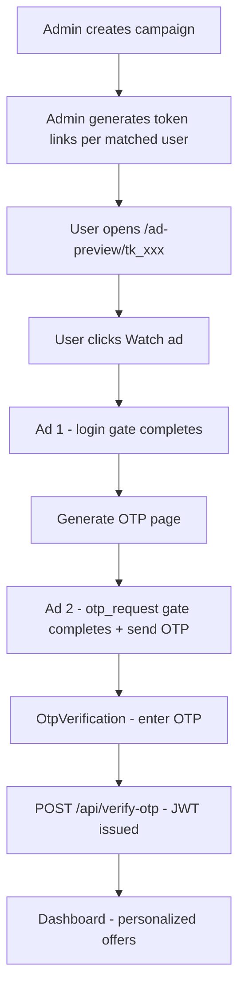
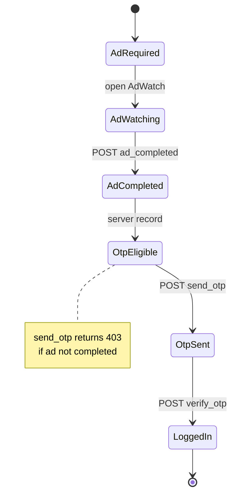

# APAD — Application Flow Guide

This document describes **how users move through the APAD platform** — Flow 1 (personalized link), Flow 2 (mobile login), admin operations, and the ad-gated OTP gate.

**Related:** [README.md](README.md) (setup), [apad_tech_doc.md](apad_tech_doc.md) (technical architecture).

---

## Core rule

```
Login → SMS offer link → (SMS path) Ad 1 → Ad 2 → OTP sent → Enter OTP on main site → Portal
```

OTP **cannot** be sent until the server records `ad_completed` for the **second** ad (`gate=otp_request`).

---

## Flow 1 — Personalized ad link → OTP → portal

**Use case:** Campaign outreach with tokenized URLs (WhatsApp, SMS, email).



| Step | Route | What happens |
| ---- | ----- | ------------ |
| 1 | Admin `/admin/campaigns` | Create campaign + targeting rules |
| 2 | Admin generates tokens | API returns URLs like `http://localhost:5173/ad-preview/tk_...` |
| 3 | `/ad-preview/:token` | Landing with personalized title/image |
| 4 | `/ad-watch?token=...` | Video plays; user must watch ≥ `min_watch_seconds` |
| 5 | API `ad/completed` (`gate=login`) | First ad done → `/generate-otp` |
| 6 | `/generate-otp` | User taps **Generate OTP** → second ad |
| 7 | API `ad/completed` (`gate=otp_request`) + `send-otp` | Second ad done → `/otp-verification` |
| 8 | `/otp-verification` | User enters OTP (POC code on screen) |
| 9 | `/dashboard` | JWT stored; personalized offers shown |

**OG preview (messengers):** Crawlers hit backend `GET /preview/{token}` → HTML with Open Graph tags → redirect humans to frontend.

---

## Flow 2 — Login → SMS offer link → ads in browser → OTP on main site

**Use case:** User signs in on the website; ads run from the SMS link; OTP is entered only on `/otp-verification`.

```mermaid
flowchart TD
  L[/login]
  S[SMS with ad-preview link]
  A[/ad-preview from SMS]
  W[Two ads on link path]
  O[OTP SMS]
  V[/otp-verification on main site]
  D[/dashboard]

  L --> S --> A --> W --> O --> V --> D
```

| Step | Route | What happens |
| ---- | ----- | ------------ |
| 1 | `/login` | `POST /api/login` → SMS with `{FRONTEND_BASE_URL}/ad-preview/tk_...?from=login` |
| 2 | `/otp-verification` | User waits; opens SMS link on phone |
| 3 | `/ad-preview/:token?from=login` | Landing (from SMS) |
| 4 | `/ad-watch` → `/generate-otp` → second `/ad-watch` | Two ad gates |
| 5 | `/link-complete` | OTP sent; no code entry on this page |
| 6 | `/otp-verification` | User enters OTP → JWT → portal |

`/get-otp` redirects to `/login`.

---

## Ad-gated OTP state machine



---

## Multi-surface advertisements

| Surface | Screen | Description |
| ------- | ------ | ----------- |
| **1** | `AdWatch` | Full video/image; must complete before OTP |
| **2** | `OtpConfirmation` | Banner ad + OTP sent message |
| **3** | `OtpConfirmation` | SMS preview panel (POC) / real SMS in production |
| **4** | `OtpVerification` | Side promo reminder while entering OTP |

---

## Admin flow

```mermaid
flowchart LR
  A[Login as admin mobile 9999999999]
  B[Complete ad + OTP like any user]
  C[JWT with role admin]
  D[/admin campaigns users analytics]

  A --> B --> C --> D
```

| Area | Path | Actions |
| ---- | ---- | ------- |
| Campaigns | `/admin/campaigns` | Create campaign, generate audience-matched token links |
| Users | `/admin/users` | List registered users |
| Analytics | `/admin/analytics` | Event counts from `analytics_events` |

---

## Analytics events (tracked automatically)

| Event | When |
| ----- | ---- |
| `preview_fetch` | OG preview or ad-preview load |
| `ad_impression` | Ad watch screen loads |
| `ad_completed` | User finishes ad |
| `otp_requested` / `otp_generated` | Send OTP |
| `otp_verified` / `login_success` | Valid OTP |
| `portal_view` | Dashboard opened |
| `user_registered` | New registration |
| `campaign_created` / `token_generated` | Admin actions |

---

## POC vs production OTP delivery

| Mode | User experience |
| ---- | ----------------- |
| **POC** (`SMS_PROVIDER=mock`) | OTP shown on `/otp-confirmation` + SMS preview text |
| **Production** | OTP arrives on phone via MSG91/Fast2SMS; UI shows masked mobile only |

Logic and API contracts are the same; only the delivery channel changes.

---

## Demo accounts (seed data)

| Role | Mobile | Notes |
| ---- | ------ | ----- |
| Admin | `9999999999` | Use for `/admin` after OTP login |
| Demo user | `9876543210` | Matches sample Travel campaign targeting (male, Hyderabad, age 28) |

Register new users via `/register` for custom testing.
