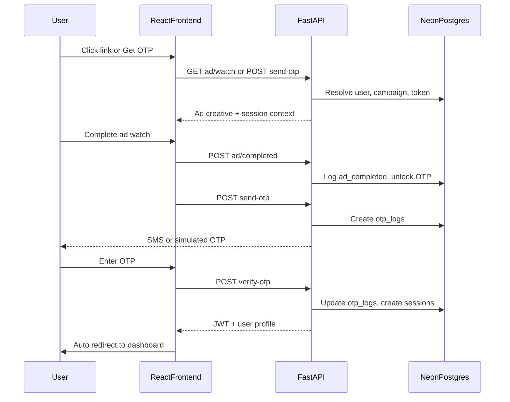
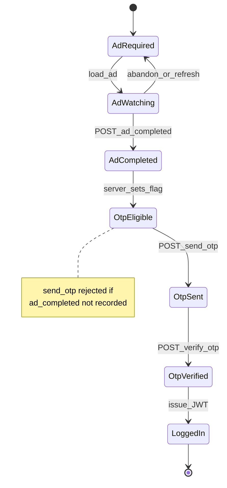
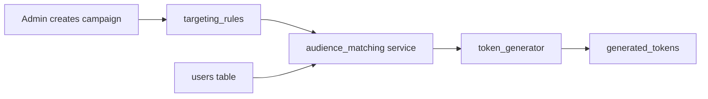
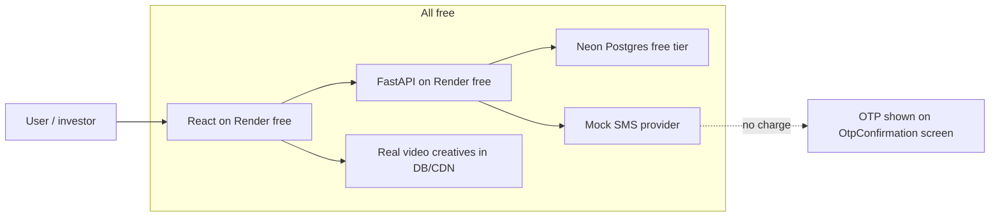
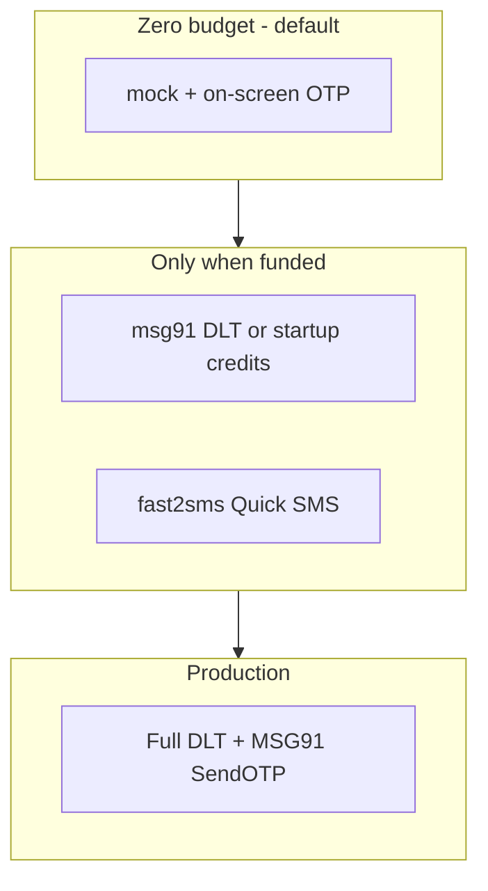
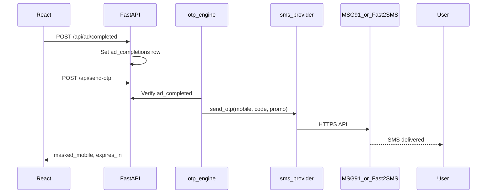

# APAD POC — Technical Documentation Plan

## Deliverable

One file: **[docs/TECHNICAL.md](docs/TECHNICAL.md)** — the canonical technical reference for developers building the POC. Your workspace is empty today; this doc will precede (and guide) code generation.

Source of truth: [Apad Poc Complete Architecture And Flow Document.pdf](d:\APAD\Apad%20Poc%20Complete%20Architecture%20And%20Flow%20Document.pdf).

---

## 1. Document structure (sections in TECHNICAL.md)


| Section                    | Purpose                                                           |
| -------------------------- | ----------------------------------------------------------------- |
| Overview & constraints     | POC-only scope, simulated vs real integrations                    |
| System context             | 3-tier diagram, trust boundaries, env vars                        |
| Core flows                 | Flow 1 (token link) and Flow 2 (app login) with sequence diagrams |
| Ad-gated OTP state machine | States, transitions, bypass prevention                            |
| Monorepo layout            | Full directory tree (below)                                       |
| Frontend architecture      | Routes, pages, components, API client, auth storage               |
| Backend architecture       | FastAPI modules, dependency injection, services                   |
| API reference              | Every endpoint: method, auth, body, response, errors              |
| Database                   | Tables, columns, indexes, relationships, sample queries           |
| Analytics event catalog    | Event names, payloads, when fired                                 |
| OG preview engine          | How `/preview/{token}` works for crawlers vs users                |
| Deployment                 | Render + Neon + GitHub; build/start commands                      |
| Zero-budget POC (₹0)       | Mock SMS + on-screen OTP — **§12 (default)**                      |
| Paid SMS research          | MSG91, Fast2SMS, Twilio, DLT — §11 (optional later)               |
| Security notes (POC)       | JWT, token expiry, rate limits (documented, minimal impl)         |
| Phase-to-file mapping      | Which files belong to which dev phase                             |


---

## 2. How the system works (content for TECHNICAL.md)

### High-level request path




### Ad-gated OTP state machine (critical gate)




**Server-side rule (document explicitly):** `POST /send-otp` and `POST /otp/send` must check a server-stored `ad_completed` flag tied to `(user_id, token_or_session_id)` — never trust frontend-only timers.

### Flow 1 vs Flow 2 entry points


| Flow   | Entry                               | Token? | First API calls                                                 |
| ------ | ----------------------------------- | ------ | --------------------------------------------------------------- |
| Flow 1 | `/ad-preview/:token` or `/p/:token` | Yes    | `GET /preview/{token}` (OG), `GET /ad/watch?token=`             |
| Flow 2 | `/login` → `/get-otp`               | No     | `POST /login` or lookup by mobile, then `GET /ad/watch?mobile=` |


Both converge on the same **AdCompletionTracker → OTPEngine → AuthEngine** pipeline.

### Audience matching (admin batch)




Matching logic (document in TECHNICAL.md):

```python
# Pseudocode — age, gender, area filters
users.filter(
  age.between(min_age, max_age),
  gender == rule.gender OR rule.gender == "any",
  area == rule.area OR rule.area == "any"
)
```

### Dynamic OG metadata

- Route: `GET /preview/{token}` (public, no JWT).
- If `User-Agent` looks like a crawler (WhatsApp, Facebook, Telegram, Twitter bot patterns), return **HTML** with injected `<meta property="og:*">` from campaign `title_template` + user name substitution.
- If normal browser, redirect to React `/ad-preview/:token` or serve landing with ad CTA.
- Fire analytics: `preview_fetch`.

---

## 3. Monorepo layout and required files

Recommended root structure:

```
apad/
├── docs/
│   └── TECHNICAL.md          # Master doc (this deliverable)
├── frontend/
│   ├── package.json
│   ├── vite.config.ts
│   ├── tailwind.config.js
│   ├── postcss.config.js
│   ├── index.html
│   ├── .env.example
│   ├── public/
│   │   └── favicon.ico
│   └── src/
│       ├── main.tsx
│       ├── App.tsx
│       ├── index.css
│       ├── lib/
│       │   ├── api.ts              # Axios instance + interceptors
│       │   ├── auth.ts             # JWT storage, logout
│       │   └── analytics.ts        # trackEvent() wrapper
│       ├── types/
│       │   ├── user.ts
│       │   ├── campaign.ts
│       │   └── api.ts
│       ├── hooks/
│       │   ├── useAuth.ts
│       │   └── useAdCompletion.ts
│       ├── components/
│       │   ├── layout/
│       │   │   ├── AppShell.tsx
│       │   │   ├── AdminLayout.tsx
│       │   │   └── Navbar.tsx
│       │   ├── ads/
│       │   │   ├── AdPlayer.tsx        # Video/image + progress
│       │   │   ├── AdCompletionGate.tsx
│       │   │   └── MultiSurfaceAd.tsx
│       │   ├── otp/
│       │   │   ├── OtpInput.tsx
│       │   │   └── OtpConfirmation.tsx
│       │   └── ui/                     # shadcn primitives (optional)
│       ├── pages/
│       │   ├── public/
│       │   │   ├── Home.tsx            # /
│       │   │   ├── Register.tsx
│       │   │   ├── Login.tsx
│       │   │   └── GetOtp.tsx
│       │   ├── ads/
│       │   │   ├── AdWatch.tsx         # /ad-watch
│       │   │   └── AdPreview.tsx       # /ad-preview/:token
│       │   ├── otp/
│       │   │   ├── OtpVerification.tsx
│       │   │   └── OtpConfirmation.tsx
│       │   ├── portal/
│       │   │   ├── Dashboard.tsx
│       │   │   ├── Offers.tsx
│       │   │   ├── Recommendations.tsx
│       │   │   └── Profile.tsx
│       │   └── admin/
│       │       ├── AdminHome.tsx
│       │       ├── Campaigns.tsx
│       │       ├── Users.tsx
│       │       └── Analytics.tsx
│       └── routes/
│           ├── index.tsx               # React Router config
│           └── ProtectedRoute.tsx
├── backend/
│   ├── requirements.txt
│   ├── .env.example
│   ├── alembic.ini                     # Optional migrations
│   ├── alembic/versions/
│   └── app/
│       ├── main.py                     # FastAPI app, CORS, routers
│       ├── config.py                   # Settings from env
│       ├── database.py                 # SQLAlchemy engine + session
│       ├── models/
│       │   ├── user.py
│       │   ├── campaign.py
│       │   ├── targeting_rule.py
│       │   ├── generated_token.py
│       │   ├── otp_log.py
│       │   ├── analytics_event.py
│       │   ├── session.py
│       │   └── ad_completion.py        # Gate state table
│       ├── schemas/
│       │   ├── user.py
│       │   ├── campaign.py
│       │   ├── token.py
│       │   ├── otp.py
│       │   ├── ad.py
│       │   └── analytics.py
│       ├── routers/
│       │   ├── users.py
│       │   ├── auth.py
│       │   ├── campaigns.py
│       │   ├── tokens.py
│       │   ├── ads.py
│       │   ├── otp.py
│       │   ├── preview.py              # OG HTML endpoint
│       │   └── analytics.py
│       ├── services/
│       │   ├── audience_matching.py
│       │   ├── token_generator.py
│       │   ├── og_metadata.py
│       │   ├── ad_delivery.py
│       │   ├── ad_completion_tracker.py
│       │   ├── otp_engine.py
│       │   ├── auth_engine.py
│       │   ├── analytics_engine.py
│       │   └── sms_provider.py         # Pluggable: msg91 | fast2sms | twilio | mock
│       └── utils/
│           ├── jwt.py
│           ├── security.py
│           └── user_agent.py           # Crawler detection
├── render.yaml                         # Optional IaC for Render
├── .gitignore
└── README.md                           # Quick start + link to TECHNICAL.md
```

**Root config files to document:** `VITE_API_BASE_URL`, `DATABASE_URL`, `JWT_SECRET`, `CORS_ORIGINS`, `SMS_PROVIDER=mock` (default ₹0 POC), `OTP_SIMULATION_MODE=true`, `OTP_SHOW_ON_SCREEN=true`.

---

## 4. Frontend — how it is organized

### Routing map (React Router)


| Path                                      | Page file             | Auth                                |
| ----------------------------------------- | --------------------- | ----------------------------------- |
| `/`                                       | `Home.tsx`            | Public                              |
| `/register`                               | `Register.tsx`        | Public                              |
| `/login`                                  | `Login.tsx`           | Public                              |
| `/get-otp`                                | `GetOtp.tsx`          | Public                              |
| `/ad-watch`                               | `AdWatch.tsx`         | Public (query: `token` or `mobile`) |
| `/ad-preview/:token`                      | `AdPreview.tsx`       | Public                              |
| `/otp-verification`                       | `OtpVerification.tsx` | Public (after ad)                   |
| `/otp-confirmation`                       | `OtpConfirmation.tsx` | Public                              |
| `/dashboard`                              | `Dashboard.tsx`       | JWT                                 |
| `/offers`, `/recommendations`, `/profile` | portal pages          | JWT                                 |
| `/admin/`*                                | admin pages           | Admin JWT/role                      |


### Key frontend behaviors to document

- `**lib/api.ts`:** Base URL from env; attach `Authorization: Bearer` after login; global 401 → logout.
- **`AdPlayer.tsx`:** Play real `creative_url`; track `timeupdate` / `ended`; optional heartbeat `POST /api/ad/progress`; disable seek-forward; on qualify call `POST /ad/completed` with `{ token?, mobile?, watch_duration }`. See §11.5 — avoid fake countdown-only UX for demos.
- `**useAdCompletion.ts`:** Poll or refetch gate status before enabling "Send OTP" button.
- `**ProtectedRoute.tsx`:** Redirect to `/login` if no JWT.
- **Admin vs user:** `user.role` in JWT claims (`user` | `admin`).

### Multi-surface ads (UI mapping)


| Surface                  | Where in frontend                             |
| ------------------------ | --------------------------------------------- |
| 1 — Before OTP           | `AdWatch.tsx` / `GetOtp.tsx` step 1           |
| 2 — OTP confirmation     | `OtpConfirmation.tsx` banner                  |
| 3 — SMS promo            | Backend SMS template (document template vars) |
| 4 — OTP entry (optional) | `OtpVerification.tsx` sidebar ad              |


---

## 5. Backend — how it is organized

### Router → service pattern

Each `routers/*.py` file stays thin: validate Pydantic schema → call `services/`* → return schema → log analytics.


| Router prefix      | Service(s)                         |
| ------------------ | ---------------------------------- |
| `/api/users`       | user CRUD                          |
| `/api/auth`        | auth_engine, jwt                   |
| `/api/campaigns`   | campaign + audience_matching       |
| `/api/tokens`      | token_generator                    |
| `/preview/{token}` | og_metadata (HTML response)        |
| `/api/ads`         | ad_delivery, ad_completion_tracker |
| `/api/otp`         | otp_engine (checks completion)     |
| `/api/analytics`   | analytics_engine                   |


### API contract summary (full detail in TECHNICAL.md)

**Auth & users**

- `POST /api/register` — body: `{ name, mobile, age, gender, area }`
- `POST /api/login` — body: `{ mobile }` → returns whether user exists + next step
- `POST /api/verify-otp` — body: `{ mobile, otp }` → `{ access_token, user }`

**Campaigns (admin)**

- `POST /api/campaign/create` — multipart or JSON + `targeting_rules`
- `GET /api/campaigns` — list with filters

**Tokens**

- `POST /api/generate-token` — body: `{ campaign_id, user_ids[] }` → list of URLs
- `GET /preview/{token}` — HTML OG or redirect (no `/api` prefix for crawler-friendly URL)

**Ads**

- `GET /api/ad/watch?token=&mobile=` — creative + user personalization fields
- `POST /api/ad/completed` — body: `{ token?, mobile?, watch_duration }` → `{ otp_eligible: true }`

**OTP**

- `POST /api/send-otp` — requires prior `ad_completed`; returns `{ masked_mobile, expires_in }`
- `POST /api/verify-otp` — same as auth verify (alias documented)

**Analytics**

- `POST /api/track-event` — body: `{ event_type, token?, user_id?, metadata? }`
- `GET /api/analytics` — admin aggregates

### Extra table for POC gate (recommended in doc)

`ad_completions` — columns: `id`, `user_id`, `token`, `campaign_id`, `completed_at`, `expires_at` (short TTL, e.g. 15 min). Prevents stale unlocks.

---

## 6. Database (documented in TECHNICAL.md)

Extend PDF schema with:

- **FKs:** `targeting_rules.campaign_id`, `generated_tokens.user_id/campaign_id`, `otp_logs.user_id`, `sessions.user_id`
- **Indexes:** `users.mobile` (unique), `generated_tokens.token` (unique), `analytics_events.event_type + timestamp`
- **ER diagram** (mermaid erDiagram block in doc)

**JWT sessions table** stores refresh optional for POC; primary auth is stateless JWT with `sub=user_id`.

---

## 7. Integration modes — **zero-budget POC (default for you)**

You are building a **POC only** and do **not** want to spend money. That is valid. Use **§12 (zero-budget)** as the default; treat §11 paid SMS as **optional later** when a client or investor funds production.

| System | Zero-budget POC (₹0) | Still “realistic” for demos? |
| ------ | -------------------- | ----------------------------- |
| **SMS / OTP** | `SMS_PROVIDER=mock` — no gateway, no wallet | **Yes visually** — show OTP on the app screen + optional “SMS preview” panel (Surface 3 text). Explain in demo: *“Production sends this via MSG91/DLT.”* |
| **Ad watch** | Real uploaded video/image + HTML5 completion (free) | **Yes** — this is not mock; only SMS is simulated |
| **OG previews** | Real backend HTML | **Yes** |
| **Analytics** | Real Postgres events | **Yes** |
| **Auth / JWT** | Real | **Yes** |
| **Hosting** | Render free + Neon free | **Yes** (within free-tier limits) |

**Do not use** a blank countdown with no creative. **Do use** real campaign media for ads; **mock only the telecom bill** (SMS).

```env
# Recommended for ₹0 POC — copy into backend/.env
SMS_PROVIDER=mock
OTP_SIMULATION_MODE=true
OTP_SHOW_ON_SCREEN=true          # After send-otp, UI displays OTP (POC substitute for SMS)
POC_SMS_PREVIEW_PANEL=true       # Surface 3: render promo+OTP as "would-be SMS" in UI
```

---

## 12. Zero-budget POC — no money from your pocket

### 12.1 Honest rule

| What | Can it be ₹0? |
| ---- | ------------- |
| Full stack app + DB + JWT + ads + analytics | **Yes** |
| OTP **appearing on a real phone** via Indian SMS gateway | **No** — someone pays (you, free trial credits, or startup program). For ₹0 **you simulate SMS in the UI**. |
| DLT registration | **No** — skip entirely for POC (~₹5k+ if you did it yourself) |

A POC can still **prove the APAD flow** (ad → gate → OTP → login → portal) without a single rupee leaving your wallet.

### 12.2 Recommended architecture (₹0)



### 12.3 How “mock SMS” still looks real in a demo

Instead of texting the phone, implement **POC OTP delivery** in the product:

1. User completes ad → clicks **Send OTP**.
2. Backend generates OTP, stores in `otp_logs`, **does not call any SMS API**.
3. Frontend navigates to **`/otp-confirmation`** and shows:
   - Masked mobile: `+91 *****3210`
   - **OTP code** in a styled box (POC mode badge)
   - **Surface 3 — SMS preview:**  
     `"Hi John, your APAD OTP is 482910. Exclusive offer: 30% OFF Bali — apad-demo.onrender.com/p/tk_92831"`
4. User copies OTP → **`/otp-verification`** → login works exactly like production.

**Script for investors:**  
*“For this POC we are not spending on TRAI/DLT SMS routes. In production, the same OTP and promo line are delivered by MSG91 or Fast2SMS; the gate and analytics are unchanged.”*

Optional: log OTP in Render logs for your debugging only (`OTP_LOG_TO_SERVER=true`).

### 12.4 What to avoid if budget is ₹0

| Avoid | Why |
| ----- | --- |
| Fast2SMS Quick / paid wallet top-up | Costs money after free ₹50 runs out |
| DLT entity registration | Thousands of rupees + time |
| Twilio upgrade with credit card | Becomes paid |
| Assuming MSG91 startup = zero hassle | No payment, but needs eligibility + logo + company email — still “real SMS”, not required for POC |

### 12.5 Optional free paths (still ₹0 **if** you never add a card)

Only use these if you want **some** real SMS without topping up wallet — **not required** for your POC:

| Option | Cost from you | Catch |
| ------ | ------------- | ----- |
| [Twilio trial](https://www.twilio.com/docs/usage/trials) | ₹0, no credit card to sign up | **~100 SMS** total, 30-day trial; often **verified numbers only**; India delivery may be restricted on trial |
| [MSG91 startups](https://msg91.com/startups) | ₹0 credits if approved | Not guaranteed; logo on site + API; still not “mock” |
| Fast2SMS ₹50 signup credit | ₹0 until credit exhausted | Then you must pay or stop |

**Recommendation for you:** stay on **`SMS_PROVIDER=mock`** + on-screen OTP. Simplest and truly ₹0.

### 12.6 Free hosting & services checklist

| Service | Free tier | Enough for POC? |
| ------- | --------- | ----------------- |
| [Neon](https://neon.tech/) Postgres | Free project, limited storage/compute | Yes |
| [Render](https://render.com/) | Free web/static (spins down on idle) | Yes |
| [GitHub](https://github.com/) | Public/private repos | Yes |
| SMS | Mock in app | Yes |
| Ad files | Store in `public/` or DB URL (your MP4/JPG) | Yes |
| Domain | `*.onrender.com` | Yes |

### 12.7 Updated env (zero-budget default)

```env
SMS_PROVIDER=mock
OTP_SIMULATION_MODE=true
OTP_SHOW_ON_SCREEN=true
POC_SMS_PREVIEW_PANEL=true
OTP_LOG_TO_SERVER=true             # optional debug in Render logs
# Leave empty — do not configure paid gateways until funded:
# MSG91_AUTH_KEY=
# FAST2SMS_API_KEY=
# TWILIO_ACCOUNT_SID=
```

### 12.8 `sms_provider.py` behavior

```python
class MockProvider:
    """Default for ₹0 POC. No HTTP call. Returns success + otp_for_ui if configured."""

    async def send_otp(self, mobile: str, otp: str, promo_line: str | None) -> SendResult:
        logger.info("POC mock SMS → %s | OTP %s | %s", mobile, otp, promo_line)
        return SendResult(
            delivered=False,           # not sent to telecom
            channel="poc_ui",
            preview_text=build_sms_preview(mobile, otp, promo_line),
        )
```

Paid providers (`MSG91Provider`, etc.) stay in the codebase behind `SMS_PROVIDER` — flip the env when money is available later.

### 12.9 What stays “real” vs “simulated” (₹0 POC)

| Feature | Real? | Simulated? |
| ------- | ----- | ---------- |
| Ad-gated OTP logic | Real | — |
| Video/image ad + completion rules | Real | — |
| Token links + OG tags | Real | — |
| Analytics in DB | Real | — |
| JWT / portal | Real | — |
| SMS to phone | — | **Simulated** (on-screen + preview panel) |
| Telecom / DLT | — | **Skipped** |

---

## 7b. Paid integrations (optional — when someone funds it)

Use §11 only if you later want real SMS. Not needed for a ₹0 POC.

| System | Local dev (free) | Paid demo (§11) | Production |
| ------ | ---------------- | ----------------- | ---------- |
| SMS | Mock (§12) | Real provider | DLT + aggregator |
| Ad watch | Real creatives | Same | VAST optional |
| OG / analytics / JWT | Real | Real | Real |

---

## 11. Real integrations research — SMS pricing, DLT, ad completion

*Research date: May 2026. Verify pricing on provider sites before purchase — rates change.*

### 11.1 Why mock SMS exists (and when to use paid SMS)

| Approach | What happens | Cost | When to use |
| -------- | ------------ | ---- | ----------- |
| **Mock + on-screen OTP (§12)** | OTP shown in app + SMS preview panel; optional server log | **₹0** | **Your case — POC, no spend** |
| **Real SMS** | OTP sent via provider API to `+91...` | Paid or limited free trial | Funded pilot / production |

Mock does **not** hit the phone network. For **₹0 POC**, that is expected — use §12 UX so demos still walk through Surface 3 **copy** on screen.

---

### 11.2 SMS provider comparison (India-focused)

APAD architecture lists **Twilio**, **Fast2SMS**, and **MSG91**. All three support HTTP APIs suitable for `sms_provider.py`.

| Provider | Free tier / trial | Typical cost per OTP (India) | DLT required? | Best for APAD POC |
| -------- | ----------------- | ------------------------------ | ------------- | ----------------- |
| **[MSG91](https://msg91.com/)** | **[Startup program](https://msg91.com/startups):** up to **25,000 OTP SMS/month for 6 months** (eligibility: new user, company email on private domain, API integrated, MSG91 logo on site) | Paid wallet: commonly **₹0.20–₹0.35/SMS** (volume/route dependent); [pricing](https://msg91.com/in/sms) is credit-based | **Yes** for normal transactional OTP route | **Best value for real SMS demos** if startup offer applies |
| **[Fast2SMS](https://www.fast2sms.com/)** | **₹50 free credit** on signup; coupon `FREE20` for ₹20 test credit | **DLT route:** from ~**₹0.11/SMS** at bulk plans; **[Quick SMS API](https://docs.fast2sms.com/reference/quick-sms):** **₹5.00/SMS** (no DLT, random numeric sender) | DLT route: yes; Quick route: no | **Fastest path to first real SMS** without DLT (₹50 credit ≈ 10 Quick SMS, or more on DLT route after setup) |
| **[Twilio](https://www.twilio.com/)** | **[Free trial](https://www.twilio.com/try-twilio)** — no credit card to start; trial balance for testing | India outbound SMS ~**$0.0832/segment** ([India pricing](https://www.twilio.com/en-us/sms/pricing/in)); **Verify** adds **$0.05 per successful verification** + SMS fees ([Verify pricing](https://www.twilio.com/en-us/verify/pricing)) — effective **~₹1.50–₹2.50/OTP** in India | Alphanumeric sender / compliance via Twilio docs | Global teams, quick API proof; **more expensive** than Indian gateways for India-only |

**Other Indian OTP gateways** (not in original PDF but comparable): Exotel, Kaleyra, Gupshup — generally **₹0.18–₹0.40/OTP**, DLT-compliant.

**Sources:** [Twilio SMS India pricing](https://www.twilio.com/en-us/sms/pricing/in), [Twilio Verify pricing](https://www.twilio.com/en-us/verify/pricing), [MSG91 deductions/pricing help](https://msg91.com/help/all-service-deductions-), [MSG91 startups](https://msg91.com/startups), [Fast2SMS Quick SMS API](https://docs.fast2sms.com/reference/quick-sms), [Fast2SMS free ₹50](https://www.fast2sms.com/help/sms-api-free/).

---

### 11.3 India regulatory reality (DLT / TRAI)

To send **legal, reliable, cheap** transactional OTP SMS to Indian numbers long-term:

1. Register as **Principal Entity (PE)** on a DLT portal (Jio, Airtel, Vi, BSNL, etc.).
2. Register **sender ID (header)** and **content template** (OTP text must match template exactly).
3. Pass **PE–TM chain** binding to your SMS aggregator (MSG91/Fast2SMS/etc.).

References: [TRAI — Advice to Senders](http://trai.gov.in/advice-to-senders), [EnableX DLT guide](https://www.enablex.io/insights/a-step-by-step-guide-to-dlt-registration/).

| Item | Typical cost / time |
| ---- | ------------------- |
| DLT entity registration | ~**₹5,000–₹7,000** one-time (operator-dependent) |
| Template + header approval | **2–5 business days** |
| Per-SMS after DLT | **₹0.11–₹0.35** (provider/volume) |

**POC shortcut:** Fast2SMS **Quick SMS** sends without DLT at **₹5/SMS** — fine for **10–20 demo logins** (≈ ₹50–₹100). Not suitable for scale or branded sender ID.

**APAD promotional SMS (Surface 3):** OTP template is usually fixed format; promotional line may need a **separate approved template** or fit in DLT variables — confirm with provider before demo.

---

### 11.4 Recommended SMS strategy (if you ever pay — not required for ₹0 POC)



| Phase | Setting | Est. cost for 100 OTP demos |
| ----- | ------- | --------------------------- |
| **₹0 POC (you)** | `SMS_PROVIDER=mock` + §12 UI | **₹0** |
| Dev | `SMS_PROVIDER=mock` | ₹0 |
| Paid demo | `SMS_PROVIDER=fast2sms`, route=quick | ~₹500 |
| Paid demo (DLT) | `SMS_PROVIDER=msg91` or `fast2sms` DLT | ~₹20–₹35 |
| Startup credits | MSG91 startups (if approved) | ₹0 credits, not ₹0 effort |

**Implementation (`backend/app/services/sms_provider.py`):**

```python
# Adapter interface — one method: send_otp(mobile: str, otp: str, promo_line: str | None) -> SendResult

class MSG91Provider: ...      # POST https://control.msg91.com/api/v5/otp (or SendOTP)
class Fast2SMSProvider: ...   # Authorization header + route param (dlt | q)
class TwilioProvider: ...     # twilio.rest Client.messages.create OR Verify API
class MockProvider: ...       # log only; used when SMS_PROVIDER=mock
```

**Env example:**

```env
SMS_PROVIDER=msg91          # mock | msg91 | fast2sms | twilio
MSG91_AUTH_KEY=
MSG91_TEMPLATE_ID=
FAST2SMS_API_KEY=
FAST2SMS_ROUTE=dlt          # dlt | q  (q = Quick, ₹5/SMS)
TWILIO_ACCOUNT_SID=
TWILIO_AUTH_TOKEN=
TWILIO_FROM_NUMBER=
OTP_SIMULATION_MODE=false   # true only on localhost
OTP_TTL_SECONDS=300
SMS_PROMO_SUFFIX=           # Surface 3 promotional text (must match DLT template vars)
```

**Security (real SMS):** Rate-limit `POST /send-otp` per mobile/IP; never return OTP in JSON when `OTP_SIMULATION_MODE=false`.

**Security (₹0 POC):** Rate-limit still applies; returning OTP in API/UI is **intentional** only when `OTP_SHOW_ON_SCREEN=true` — disable in any public deployment without auth.

---

### 11.5 Ad completion — realistic tracking (not a fake timer)

A **mock timer** (e.g. “wait 10 seconds”) is easy to cheat and weak for demos. **Realistic POC** = real campaign creative + measurable playback + server gate.

| Method | Realistic? | POC fit | Implementation |
| ------ | ---------- | ------- | -------------- |
| Countdown with no video | No | Avoid for demos | — |
| HTML5 `<video>` `timeupdate` + `ended` | Yes | **Recommended** | Fire `ad_impression` at start; `ad_completed` only if `currentTime >= duration * 0.95` or `ended` |
| Heartbeat beacons | Yes | Recommended | Every 5s: `POST /api/ad/progress` `{ token, seconds_watched }`; server sums |
| Tab visibility / blur pause | Yes | Recommended | Pause player when `document.hidden`; do not count hidden time |
| Image / carousel ad | Partial | OK for static creatives | Minimum **view time** + user must stay on route (no background tab) |
| VAST quartile URLs (`start`, `firstQuartile`, `complete`) | Industry standard | Phase 6 / optional | [IAB VAST](https://iabtechlab.com/standards/vast/) tracking events; aligns with [Google Ad Manager video metrics](https://support.google.com/admanager/answer/2759433) |

**Server rule (unchanged):** `POST /api/ad/completed` accepts completion only if:

- `ad_completions` row not already set for this session/token, and
- `watch_duration >= campaign.min_watch_seconds` (from DB), and
- optional: last heartbeat within 30s (anti-spam).

**Frontend (`AdPlayer.tsx`):**

- Load `creative_url` from `GET /api/ad/watch`.
- Disable seek forward; optionally disable playback rate.
- On qualify → `POST /api/ad/completed` → enable “Send OTP”.

**Multi-surface ads:** Surfaces 1–2 use same creative components; Surface 3 is SMS template text; Surface 4 is banner in `OtpVerification.tsx` — all **real content from DB**, not placeholders.

---

### 11.6 What stays “simulated” vs always real

| Feature | Always real in POC | Optional mock |
| ------- | ------------------ | --------------- |
| Tokenized links + DB | Yes | — |
| OG meta personalization | Yes | — |
| Analytics events → Postgres | Yes | — |
| JWT login | Yes | — |
| SMS to phone | **Yes for demos** | Local dev only |
| Video/image ad playback | **Yes for demos** | Static image OK; skip fake timer |
| WhatsApp link preview | Real HTTP to `/preview/{token}` | — |

---

### 11.7 POC demo budget example

**Your path (₹0):** mock SMS + Render/Neon free → **₹0 total**.

Paid path (only if funded) — 50 users, 1 OTP each:

| Item | Provider | Est. total |
| ---- | -------- | ---------- |
| OTP SMS | Mock + on-screen | **₹0** |
| OTP SMS | MSG91 @ ₹0.25 | ₹12.50 |
| Hosting | Render free + Neon free | ₹0 |

---

### 11.8 `sms_provider.py` request flow (real SMS)



---

## 8. Deployment (TECHNICAL.md section)


| Service  | Render type | Build                             | Start                                              |
| -------- | ----------- | --------------------------------- | -------------------------------------------------- |
| frontend | Static Site | `npm run build`                   | publish `dist/`                                    |
| backend  | Web Service | `pip install -r requirements.txt` | `uvicorn app.main:app --host 0.0.0.0 --port $PORT` |
| DB       | Neon        | —                                 | `DATABASE_URL` SSL                                 |


Document CORS: frontend origin → backend. Document path rewrite: public links use `/p/:token` proxied to backend preview or React route.

---

## 9. Phase-to-file mapping (for implementation order)


| Phase          | Files touched first                                                                 |
| -------------- | ----------------------------------------------------------------------------------- |
| 1 Setup        | `package.json`, `main.py`, `database.py`, `config.py`, `.env.example`, `README.md`  |
| 2 Auth         | `routers/users.py`, `auth.py`, `otp.py`, `Register.tsx`, `Login.tsx`, `Otp*.tsx`    |
| 3 Campaigns    | `campaigns.py`, `audience_matching.py`, `token_generator.py`, `admin/Campaigns.tsx` |
| 4 Ad-gated OTP | `AdPlayer.tsx`, `ad_completion.py`, `ad_completion_tracker.py`, `GetOtp.tsx`        |
| 5 Portal       | `Dashboard.tsx`, `analytics.py`, `admin/Analytics.tsx`                              |
| 6 Optional     | `encryption-wasm/` (separate section, out of MVP)                                   |


---

## 10. Execution steps (after you approve)

1. Create `docs/TECHNICAL.md` with all sections above (full API tables, SQL DDL, env var list, copy-paste curl examples).
2. Merge §11 (real SMS + ad completion) into the master doc.
3. Add minimal `README.md` pointing to `docs/TECHNICAL.md`.
4. Register DLT + MSG91/Fast2SMS account in parallel with Phase 2 (OTP) so demos use real SMS.
5. Optionally scaffold empty files from the tree (only if you ask to "implement" next).

No application code in this step unless you request scaffolding — deliverable is **documentation only** per your choice of single master doc.

---

## Document changelog

| Date | Change |
| ---- | ------ |
| May 2026 | Added §7 integration modes + §11 SMS/DLT/ad-completion research (mock vs realistic) |
| May 2026 | Added §12 zero-budget POC; §7 default = mock SMS, no spend |