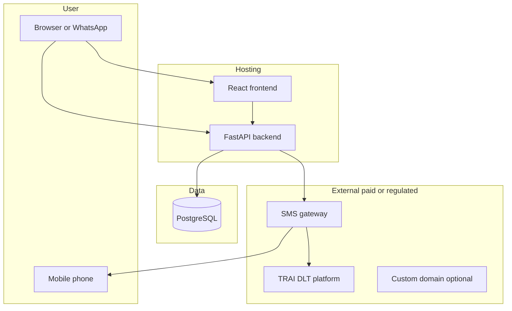

# APAD — Realistic Services & Production Needs

This document lists **every external service and integration** needed when APAD moves beyond the **₹0 POC** (mock SMS, on-screen OTP). It explains **purpose**, **how each piece fits the APAD flows**, **whether it is required**, and **typical costs** (India-focused).

**Related docs:** [apad_tech_doc.md](apad_tech_doc.md) (technical architecture), [Apad Poc Complete Architecture And Flow Document.pdf](Apad%20Poc%20Complete%20Architecture%20And%20Flow%20Document.pdf) (product flows).

*Pricing and free tiers change — verify on provider websites before purchase. Research baseline: May 2026.*

---

## 1. What “realistic” means

| Mode | OTP delivery | India DLT | Typical spend |
| ---- | ------------ | --------- | ------------- |
| **₹0 POC** | Mock — OTP shown in app UI | Skipped | ₹0 |
| **Realistic / production** | SMS gateway → user’s real phone | Required for proper Indian transactional SMS | ~₹5k+ one-time DLT + per-SMS + hosting |

**You build:** React UI, FastAPI backend, PostgreSQL, JWT auth, campaigns, audience matching, tokenized links, ad-gated OTP logic, OG previews, analytics.

**You register / pay for:** Hosting (can start free), **SMS aggregator + TRAI DLT** for real OTP to Indian mobiles.



---

## 2. Master services table

### A. Core platform (required to run APAD)

| Service | Purpose in APAD | Required? | Typical cost |
| ------- | ----------------- | ----------- | -------------- |
| **GitHub** | Source code, version control, deploy hooks to hosting | Yes | Free (private repos OK) |
| **React (Vite)** | User portal, admin dashboard, ad watch, OTP screens, login | Yes — you build | Free (open source) |
| **FastAPI** | Auth, OTP engine, campaigns, tokens, ad completion gate, OG HTML, analytics APIs | Yes — you build | Free |
| **PostgreSQL ([Neon](https://neon.tech/))** | Users, campaigns, `generated_tokens`, `otp_logs`, `ad_completions`, `analytics_events`, sessions | Yes | Free tier → paid if usage grows (~$19+/mo) |
| **Render** (or Railway / Fly.io) | Host frontend static site + backend API publicly | Yes for live demo/production | Free tier (cold start) → ~**$7/mo** per web service for always-on |
| **JWT** (PyJWT in backend) | Auto-login after OTP; distinguish `user` vs `admin` | Yes | Free — no vendor |

**Role in flow:** User opens app → React calls FastAPI → all business state in Postgres. No third party except hosting until OTP is sent.

---

### B. SMS / OTP (required for real phone OTP)

| Service | Purpose in APAD | Required for realistic India OTP? | Typical cost |
| ------- | ----------------- | ----------------------------------- | -------------- |
| **SMS aggregator** (MSG91, Fast2SMS, or Twilio) | After ad completion, sends OTP + optional **Surface 3** promotional line to `+91...` | **Yes** | Per message (see §4) |
| **TRAI DLT** (Jio / Airtel / Vi / BSNL portal) | Register business, sender ID (header), approved SMS templates; messages blocked without compliance | **Yes** for legal, cheap Indian transactional OTP | ~**₹5,000–₹7,000** one-time + **2–5 business days** approval |

**Backend integration:** `backend/app/services/sms_provider.py` — adapter pattern with `SMS_PROVIDER=msg91|fast2sms|twilio`.

**APAD rule:** `POST /api/send-otp` only succeeds if `ad_completions` exists for that user/session/token.

---

### C. Ad delivery & completion (mostly your stack)

| Service | Purpose in APAD | Required? | Typical cost |
| ------- | ----------------- | ----------- | -------------- |
| **PostgreSQL + media URLs** | Store campaign `image_url` / video URL; serve in `AdPlayer` | Yes | Included in Neon/hosting |
| **Object storage** (AWS S3, Cloudinary, etc.) | Host large MP4/JPG at scale | Optional for small pilot | Free tiers → usage-based |
| **HTML5 video + server gate** | Track watch progress / `ended`; `POST /api/ad/completed` unlocks OTP | Yes — your code | Free |
| **VAST / IAB ad verification** | Quartile tracking (`start`, `firstQuartile`, `complete`), viewability | Production enhancement only | Ad-tech cost; not needed for first realistic pilot |

**Note:** Realistic APAD does **not** require Google Ads or a third-party ad network for the POC. You upload creatives; the platform enforces watch-before-OTP.

---

### D. Personalized links & social previews

| Service | Purpose in APAD | Required? | Typical cost |
| ------- | ----------------- | ----------- | -------------- |
| **FastAPI `GET /preview/{token}`** | WhatsApp/Telegram/Facebook crawlers fetch **Open Graph** meta (personalized title, image, description) | Yes — your backend | Free |
| **Public HTTPS URL** | Crawlers must reach the preview endpoint | Yes | `*.onrender.com` free, or custom domain |

**Flow:** Admin generates token → user receives link → messenger shows personalized preview → user clicks → ad watch → OTP → portal.

---

### E. Analytics

| Service | Purpose in APAD | Required? | Typical cost |
| ------- | ----------------- | ----------- | -------------- |
| **Postgres `analytics_events`** | `preview_fetch`, `ad_impression`, `ad_completed`, `otp_requested`, `otp_verified`, `login_success`, `portal_view`, `conversion_event` | Yes | Same as Neon |
| **Google Analytics / Mixpanel** (optional) | External marketing analytics | No | Free tiers available |

---

### F. Optional / later

| Service | Purpose | When to add |
| ------- | ------- | ----------- |
| **Custom domain** | `apad.yourbrand.com` instead of Render subdomain | Investor or brand polish |
| **CDN (Cloudflare)** | Faster static assets and video | Higher traffic |
| **Email OTP** (SendGrid, Amazon SES) | Backup verification channel | Enterprise / global |
| **WhatsApp Business API** | Deliver links or OTP on WhatsApp | Product phase 2 |
| **Rust + WASM encryption demo** | Architecture PDF optional enhancement | Patent / research demo |

---

## 3. SMS provider comparison (India)

| Provider | Best for | DLT required? | Free tier | Typical cost per OTP (India) |
| -------- | -------- | ------------- | --------- | ------------------------------ |
| **[MSG91](https://msg91.com/)** | India-first production OTP | Yes (normal route) | [Startup program](https://msg91.com/startups): up to **25,000 OTP SMS/month × 6 months** if eligible | **₹0.20–₹0.35/SMS** (wallet) |
| **[Fast2SMS](https://www.fast2sms.com/)** | India; Quick route for pre-DLT tests | DLT route: yes; **Quick API: no** | **₹50** signup credit | DLT: **~₹0.11/SMS**; Quick: **₹5.00/SMS** |
| **[Twilio](https://www.twilio.com/)** / **Verify** | Global teams, US/EU testers | Twilio compliance docs | Trial: **~100 SMS**, 30 days, [no credit card to start](https://www.twilio.com/docs/usage/trials) | ~**$0.0832/segment** + Verify fees → **~₹1.50–₹2.50/OTP** |

**Recommendation (India + real phone):** **DLT registration + MSG91** (or Fast2SMS on DLT route).

**Avoid for production scale:** Fast2SMS Quick route (₹5/SMS, random sender, no DLT).

**References:**

- [Twilio SMS India pricing](https://www.twilio.com/en-us/sms/pricing/in)
- [Twilio Verify pricing](https://www.twilio.com/en-us/verify/pricing)
- [MSG91 pricing / deductions](https://msg91.com/help/all-service-deductions-)
- [Fast2SMS Quick SMS API](https://docs.fast2sms.com/reference/quick-sms)
- [TRAI — Advice to Senders](http://trai.gov.in/advice-to-senders)

---

## 4. India DLT / TRAI (regulatory)

To send **legal, reliable, low-cost** transactional OTP SMS to Indian numbers:

1. Register as **Principal Entity (PE)** on a DLT portal (Jio TrueConnect, Airtel, Vodafone Idea, BSNL, etc.).
2. Register **sender ID (header)** — e.g. 6-character brand code.
3. Register **content template(s)** — OTP text must **match the approved template exactly** (variables in `{#var#}` slots).
4. Bind **PE–TM chain** to your SMS aggregator (MSG91 / Fast2SMS).

| Item | Typical cost / time |
| ---- | ------------------- |
| DLT entity registration | **₹5,000–₹7,000** one-time |
| Template + header approval | **2–5 business days** |
| Per SMS after approval | **₹0.11–₹0.35** (provider + volume) |

**APAD Surface 3 (promo in SMS):** Promotional line may need its own approved template or fit within DLT variable slots — confirm with your provider before go-live.

**Guides:** [EnableX DLT step-by-step](https://www.enablex.io/insights/a-step-by-step-guide-to-dlt-registration/)

---

## 5. Flow mapping — which service handles what

### Flow 1 — Personalized ad link → OTP → portal

| Step | Service / component |
| ---- | ------------------- |
| Admin creates campaign | FastAPI + PostgreSQL |
| Audience matching + token URLs | FastAPI (`audience_matching`, `token_generator`) |
| User receives link | Out of band (manual, WhatsApp, or future bulk SMS campaign) |
| OG preview in messenger | FastAPI `og_metadata` + HTTPS host |
| User watches ad | React `AdPlayer` + campaign media URL |
| Ad completion recorded | FastAPI → `ad_completions` |
| OTP sent to phone | **SMS gateway + DLT template** |
| User enters OTP | React + FastAPI `otp_engine` |
| Auto login + portal | JWT + PostgreSQL |

### Flow 2 — App login with mobile OTP

Same pipeline; entry is `/login` → `/get-otp` (no token in URL initially).

### Multi-surface advertisements

| Surface | Where | Service |
| ------- | ----- | ------- |
| **1** — Before OTP | `AdWatch` / `GetOtp` | React + your media |
| **2** — OTP confirmation | `OtpConfirmation` | React + campaign creative |
| **3** — SMS promotional line | Text inside OTP SMS | **SMS gateway** (DLT template) |
| **4** — OTP entry (optional) | `OtpVerification` | React sidebar/banner |

---

## 6. Minimum realistic stack (setup order)

1. **GitHub** — repository  
2. **Neon** — PostgreSQL  
3. **Render** — deploy React (static) + FastAPI (web service)  
4. **DLT portal** — Principal Entity + header + OTP template (+ promo template if needed)  
5. **MSG91 or Fast2SMS (DLT route)** — connect to `sms_provider.py`  
6. **Campaign creatives** — video/image URLs in DB (or object storage later)

**Defer until later:** Twilio (costly for India-only), VAST/ad verification vendors, WhatsApp Business API, paid analytics SaaS.

---

## 7. Cost estimate summary

### One-time

| Item | Estimate (INR) |
| ---- | -------------- |
| DLT Principal Entity registration | ₹5,000 – ₹7,000 |
| Domain (optional, 1 year) | ₹500 – ₹1,500 |

### Recurring / usage

| Item | Estimate |
| ---- | -------- |
| Render (2 always-on services) | ~$7–14 USD/mo (~₹600 – ₹1,200) |
| Neon | ₹0 on free tier; paid if scaled |
| SMS — 100 OTPs/month (DLT route) | ₹11 – ₹35 |
| SMS — 100 OTPs (Fast2SMS Quick, no DLT) | ~₹500 |
| MSG91 startup credits (if approved) | ₹0 SMS cost within monthly cap |

### Rough total to go “real SMS” properly

| | Amount |
| -- | ------ |
| **Minimum upfront** | ~**₹5,000 – ₹7,000** (DLT) + optional domain |
| **Monthly (light demo)** | ~**₹0 – ₹1,500** (hosting + ~100 SMS) |

---

## 8. What you do NOT need a separate vendor for

| Capability | Implemented by |
| ---------- | -------------- |
| User registration & profiles | FastAPI + PostgreSQL |
| Campaign management | FastAPI + admin React |
| Audience matching | FastAPI service |
| Tokenized personalized URLs | FastAPI + `generated_tokens` |
| Advertisement-gated OTP logic | `ad_completion_tracker` + `otp_engine` |
| JWT sessions / auto-login | FastAPI + PyJWT |
| Dynamic OG metadata | FastAPI `preview` router |
| Analytics event pipeline | PostgreSQL + `track-event` API |
| Admin analytics dashboard | React + aggregation APIs |

---

## 9. Environment variables (production / realistic)

```env
# Core
DATABASE_URL=postgresql://...
JWT_SECRET=<strong-random-secret>
CORS_ORIGINS=https://your-frontend.onrender.com

# Frontend
VITE_API_BASE_URL=https://your-api.onrender.com

# SMS — pick one provider
SMS_PROVIDER=msg91
OTP_SIMULATION_MODE=false
OTP_SHOW_ON_SCREEN=false

# MSG91 (example)
MSG91_AUTH_KEY=
MSG91_TEMPLATE_ID=
MSG91_SENDER_ID=

# Fast2SMS (example)
# FAST2SMS_API_KEY=
# FAST2SMS_ROUTE=dlt

# Twilio (example — global)
# TWILIO_ACCOUNT_SID=
# TWILIO_AUTH_TOKEN=
# TWILIO_VERIFY_SERVICE_SID=

# DLT (store in config or DB)
DLT_ENTITY_ID=
DLT_HEADER_ID=
DLT_OTP_TEMPLATE_ID=
```

**Security (production):** Never return OTP in API responses. Rate-limit `POST /api/send-otp` per mobile and IP.

---

## 10. Accounts & checklist before go-live

| # | Task | Done |
| - | ---- | ---- |
| 1 | GitHub repo created | ☐ |
| 2 | Neon project + `DATABASE_URL` | ☐ |
| 3 | Render frontend + backend deployed | ☐ |
| 4 | DLT Principal Entity approved | ☐ |
| 5 | DLT header (sender ID) approved | ☐ |
| 6 | DLT OTP template approved (matches code exactly) | ☐ |
| 7 | DLT promo template approved (if Surface 3 in SMS) | ☐ |
| 8 | PE–TM chain bound to MSG91/Fast2SMS | ☐ |
| 9 | SMS provider API keys in Render env | ☐ |
| 10 | `SMS_PROVIDER` set; mock disabled | ☐ |
| 11 | HTTPS preview URL tested in WhatsApp | ☐ |
| 12 | End-to-end test: ad complete → SMS on phone → login | ☐ |

---

## 11. Realistic vs ₹0 POC (quick comparison)

| Aspect | ₹0 POC | Realistic / production |
| ------ | ------ | ---------------------- |
| OTP delivery | On-screen + “SMS preview” panel | SMS to real phone |
| DLT | Skipped | Required (India) |
| Ad watch | Real video/image + server gate | Same |
| OG / tokens / analytics / JWT | Real | Same |
| Money from your pocket | **₹0** | **~₹5k+** one-time DLT + usage |

For zero-budget implementation details, see **§12** in [apad_tech_doc.md](apad_tech_doc.md).

---

## 12. Document changelog

| Date | Change |
| ---- | ------ |
| May 2026 | Initial production services guide created |
